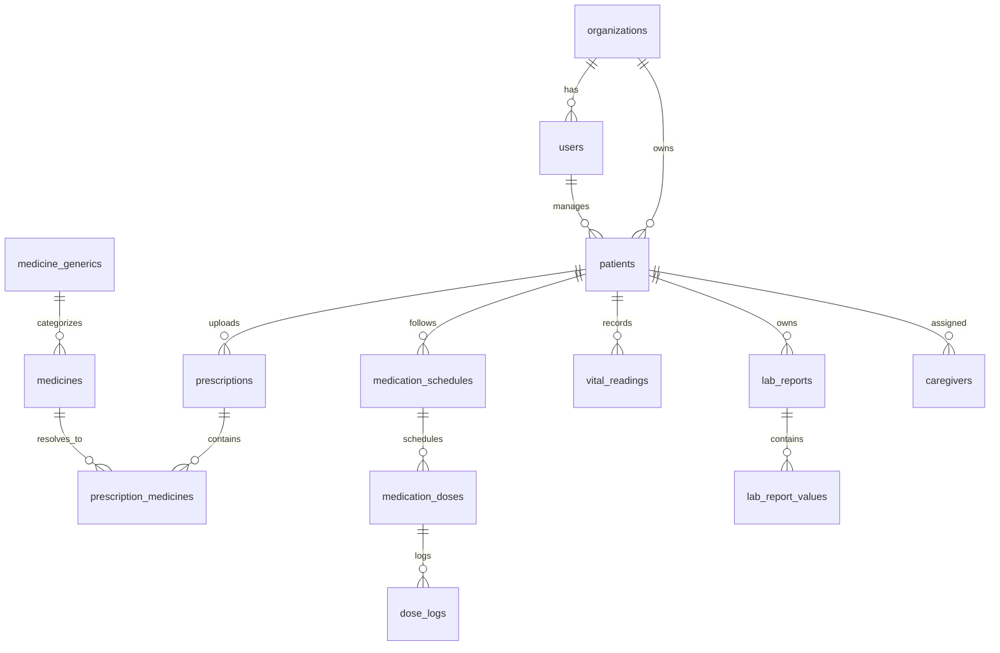

# MediFlow BD (PrescriptionMate BD) — Master Production Architecture & Engineering Blueprint

> **Notice:** This document is the single source of truth (SSOT) for the architecture, safety standards, database schemas, and engineering roadmap of MediFlow BD. All future modules, services, and code generation must strictly adhere to the guidelines set forth here.

---

## 1. Executive Summary & Legal / Regulatory Foundation

### 1.1 Positioning: Medication & Prescription Management Platform
- **MediFlow BD is NOT an "AI Doctor" or automated prescribing system.**
- **AI Scope:** Limited strictly to **OCR Data Extraction**, **Human-Friendly Explanation (Bangla & English)**, and **Event-Driven Alerting**.
- **Medication Decision Boundaries:** Diagnosis, medication selection, dosage adjustment, and drug interactions MUST BE governed by **deterministic rule engines**, **verified medical databases**, and **mandatory human verification (Doctor / Pharmacist / Patient)**.

### 1.2 Regulatory & Policy Compliance
- **DGDA (Directorate General of Drug Administration, Bangladesh):** Prescription-only medications must be dispensed strictly against a valid registered physician's prescription by a licensed pharmacist. AI will never alter or autonomously recommend drug replacements without pharmacist/physician oversight.
- **DGHS Bangladesh Digital Health Strategy (2023–2027):** Interoperability, data privacy, patient consent, and structured electronic health data alignment.

---

## 2. The 5 Core Engineering Principles

```
1. AI EXTRACTS  ───────►  HUMAN (DOCTOR/PATIENT) CONFIRMS
2. AI EXPLAINS   ───────►  VERIFIED MEDICAL RULES DECIDE SAFETY
3. LOCAL DEVICE  ───────►  HANDLES NATIVE ALARMS (OFFLINE-FIRST)
4. CLOUD BACKEND ───────►  HANDLES SYNC, ANALYTICS & CAREGIVER ESCALATIONS
5. MULTI-TENANT  ───────►  STRICT ISOLATION, RBAC & IMMUTABLE AUDIT TRAILS
```

---

## 3. 19-Feature Feasibility & Safety Matrix

| # | Feature Name | Feasibility | Technical Architecture | Safety / Operational Rule |
|---|--------------|-------------|------------------------|---------------------------|
| 1 | **Prescription OCR** | ✅ High | Gemini 2.5 Flash Vision + Zod Schema Validation | Requires human confirmation before database commit. |
| 2 | **Generic / Price Comparison** | ⚠️ Medium | Deterministic Medicine DB + Pharmacy Pricing Engine | Warning: "Brand substitution must be verified with a doctor/pharmacist." |
| 3 | **Expiry Scanner** | ✅ High | OCR + Vision Confidence + Manual Confirmation | Alert on near-expiry (<30 days) and expired items. |
| 4 | **Lab Report Decoder** | ⚠️ Medium/High | Gemini OCR + Reference Range Engine | Only flags values outside lab reference range; NEVER diagnoses illness. |
| 5 | **Prescription Vault** | ✅ High | Private Object Storage (S3/R2) + Signed URLs + Postgres | Strict patient/caregiver access control; encrypted at rest. |
| 6 | **Missed-Dose Escalation** | ✅ High | Local device alarm -> Redis/QStash event queue -> WhatsApp/Push | Multi-tier escalation: 0m (Local) -> 15m (Reminder) -> 45m (Missed) -> 60m (Caregiver). |
| 7 | **Bangla Voice Confirmation** | ⚠️ Medium | Speech-to-Text (STT) + Intent Classification | High confidence voice confirmation with fallback button. |
| 8 | **Offline Native Alarm** | ✅ High | SQLite + OS Local Scheduled Notifications | Primary alarms fire reliably with zero internet connection. |
| 9 | **Antibiotic Completion Guard**| ⚠️ High | Prescription-defined course counter (Day X of Y) | Educational adherence tracker; never independently changes course. |
| 10| **Food & Water Reminder** | ⚠️ Medium | Verified instruction DB (Before/After food, empty stomach) | Attached deterministically to dose timing. |
| 11| **Drug Interaction Warning** | ⚠️ High Complexity| Curated Clinical Interaction Database + Severity Engine | AI only translates/explains the clinical warning in Bangla. |
| 12| **Emergency Medical ID** | ✅ High | Local encrypted profile on lock screen | Offline accessible: Blood group, allergies, conditions, emergency call. |
| 13| **Family Profiles** | ✅ High | Multi-patient RBAC with granular caregiver permissions | Permission levels: Medication management, Vitals view-only, Full Admin. |
| 14| **Insulin Site Rotation** | ⚠️ Medium | Visual anatomical tracking & rotation log | Educational tracking tool; no clinical insulin dosage advice. |
| 15| **Doctor Visit PDF** | ✅ High | Headless SSR / PDF generation service | Generates consolidated report: Adherence %, Vitals trend, active meds. |
| 16| **Pill / Refill Alert** | ✅ High | Inventory countdown ledger | Alerts triggered when stock drops below 3–5 days threshold. |
| 17| **Vitals Tracking & Trend** | ✅ High | Time-series schema (BP, Glucose, SpO2, Pulse, Temp) | Descriptive statistics (7-day/30-day avg); no clinical judgments. |
| 18| **24/7 Emergency Pharmacy & Oxygen**| ⚠️ Medium | Verified Geo-Directory + Verified Badges | Pre-verified listings with direct click-to-call & operating hours. |
| 19| **Home Sample Booking (Phase 4)**| ⚠️ Medium | Diagnostic partner portal & booking queue | Phase 4 marketplace integration. |

---

## 4. Production System Architecture

```
┌─────────────────────────────────────────────────────────────────┐
│                       CLIENT LAYER                              │
│  ┌───────────────────────────────┐  ┌─────────────────────────┐ │
│  │   React Native (Expo Mobile)  │  │   Next.js 16 Web Client │ │
│  │  - Local SQLite Storage       │  │  - Doctor Portal        │ │
│  │  - Native Scheduled Alarms    │  │  - Pharmacy Portal      │ │
│  │  - Camera & Offline ID        │  │  - Super Admin Portal   │ │
│  └───────────────┬───────────────┘  └────────────┬────────────┘ │
└──────────────────┼───────────────────────────────┼──────────────┘
                   │ HTTPS / JWT Auth              │
                   ▼                               ▼
┌─────────────────────────────────────────────────────────────────┐
│                API GATEWAY & BFF LAYER (Next.js)                │
│  - Organization Tenant Isolation & JWT Verification             │
│  - Granular RBAC + Resource-Level Ownership Checks              │
│  - Rate Limiting & Input Validation (Zod)                       │
│  - Immutable Audit Log Middleware                               │
└──────────────┬───────────────────────────┬──────────────────────┘
               │                           │
               ▼                           ▼
┌──────────────────────────────┐ ┌────────────────────────────────┐
│   CORE DATA & STORAGE        │ │     BACKGROUND JOB QUEUE       │
│  ┌────────────────────────┐  │ │  ┌──────────────────────────┐  │
│  │ PostgreSQL (Neon)      │  │ │  │ Upstash Redis / QStash   │  │
│  │ - 28 Relational Tables │  │ │  │ - Dose Due Alarms        │  │
│  │ - Row-Level Tenant IDs │  │ │  │ - Missed-Dose Worker     │  │
│  └────────────────────────┘  │ │  │ - Caregiver Escalation   │  │
│  ┌────────────────────────┐  │ │  │ - WhatsApp Dispatcher    │  │
│  │ Private Object Storage │  │ │  └─────────────┬────────────┘  │
│  │ - Encrypted Prescript. │  │ └────────────────┼───────────────┘
│  │ - Signed Short URLs    │  │                  │
│  └────────────────────────┘  │                  ▼
└──────────────────────────────┘ ┌────────────────────────────────┐
                                 │       EXTERNAL ADAPTERS        │
                                 │  - Meta WhatsApp Cloud API     │
                                 │  - Push Notifications (Expo)   │
                                 │  - Local SMS Gateway (BD)      │
                                 └────────────────────────────────┘
               ▲
               │
┌──────────────┴──────────────────────────────────────────────────┐
│                    INTELLIGENCE & SAFETY LAYER                  │
│                                                                 │
│   ┌──────────────────────────┐     ┌────────────────────────┐   │
│   │   AI Pipeline (Gemini)   │     │  Safety Rule Engine    │   │
│   │   - 2.5 Flash Vision OCR │     │  - Drug Interactions   │   │
│   │   - Structured JSON Zod  │────►│  - Duplicate Therapy   │   │
│   │   - Bangla Explanation   │     │  - Dosage Limit Check  │   │
│   │   - Versioned Prompts    │     │  - Food Timing Rules   │   │
│   └──────────────────────────┘     └───────────┬────────────┘   │
│                                                │                │
│                                                ▼                │
│                                    ┌────────────────────────┐   │
│                                    │ Verified Medicine DB   │   │
│                                    │ - Generics, Brands     │   │
│                                    │ - Strengths, Packaging │   │
│                                    │ - Interactions Index   │   │
│                                    └────────────────────────┘   │
└─────────────────────────────────────────────────────────────────┘
```

---

## 5. Technology Stack Specifications

| Layer | Technology | Justification |
|---|---|---|
| **Mobile App** | React Native (Expo) | Native local notifications, SQLite offline caching, hardware camera, background tasks, iOS & Android parity. |
| **Web & Backend API** | Next.js 16 (Modular Monolith) | Single TypeScript codebase, edge API routes, server actions, SSR for portals and PDF reports. |
| **Database** | PostgreSQL (Neon / Supabase) | ACID compliance, relational integrity, JSONB support for test data, connection pooling. |
| **ORM & Validation** | Prisma ORM + Zod | Type-safe queries, automatic migration management, end-to-end schema validation. |
| **Queue / Scheduler** | Upstash Redis + QStash | Serverless-friendly scheduling for dose check escalations and background jobs. |
| **AI Vision & NLP** | Google Gemini 2.5 Flash | High-accuracy document OCR, native structured JSON output, low latency, cost-effective. |
| **UI Components** | Tailwind CSS + shadcn/ui | Clean, modern design tokens, accessible components, dark/light mode support. |

---

## 6. Complete Database Architecture (28 Tables)



### Table Definitions:

1. **`organizations`**: SaaS tenant entity (`id`, `name`, `type`, `tier`, `created_at`).
2. **`users`**: Platform accounts (`id`, `org_id`, `name`, `email`, `phone`, `password_hash`, `role`, `status`).
3. **`patients`**: Patient entities (`id`, `org_id`, `created_by_user_id`, `name`, `dob`, `gender`, `blood_group`, `emergency_phone`).
4. **`caregivers`**: Link between users and patients (`id`, `user_id`, `patient_id`, `relationship`, `is_primary`).
5. **`caregiver_permissions`**: Granular access control (`caregiver_id`, `can_view_vitals`, `can_edit_meds`, `receives_escalations`).
6. **`prescriptions`**: Master prescription record (`id`, `patient_id`, `doctor_name`, `hospital_name`, `date`, `status`, `notes`).
7. **`prescription_images`**: Storage references (`id`, `prescription_id`, `storage_key`, `mime_type`, `file_size`, `sha256_hash`).
8. **`medicines`**: Bangladesh master brand catalog (`id`, `generic_id`, `brand_name`, `strength`, `dosage_form`, `manufacturer`, `unit_price`).
9. **`medicine_generics`**: Active pharmaceutical ingredients (`id`, `generic_name`, `therapeutic_class`, `description`).
10. **`medicine_brands`**: Manufacturer & brand index.
11. **`medicine_instructions`**: Standard timing rules (`id`, `medicine_id`, `instruction_type`, `food_relation`, `bangla_text`).
12. **`medicine_interactions`**: Verified clinical interaction matrix (`id`, `generic_a_id`, `generic_b_id`, `severity`, `clinical_effect`, `action_required`).
13. **`prescription_medicines`**: Extracted line items (`id`, `prescription_id`, `medicine_id`, `raw_name`, `dose`, `frequency`, `duration_days`, `confidence`).
14. **`medication_schedules`**: Active schedules (`id`, `patient_id`, `prescription_medicine_id`, `start_date`, `end_date`, `times_per_day`, `status`).
15. **`medication_doses`**: Concrete dose instances (`id`, `schedule_id`, `scheduled_at`, `status`).
16. **`dose_logs`**: Immutable execution log (`id`, `dose_id`, `action`, `taken_at`, `logged_by_user_id`, `source`).
17. **`lab_reports`**: Master diagnostic reports (`id`, `patient_id`, `lab_name`, `report_date`, `storage_key`).
18. **`lab_report_values`**: Normalized lab parameters (`id`, `lab_report_id`, `test_name`, `value`, `unit`, `flag`).
19. **`reference_ranges`**: Standard normal laboratory ranges (`id`, `test_name`, `gender`, `min_value`, `max_value`, `unit`).
20. **`vitals`**: Vital signs catalogue (`id`, `code`, `name`, `unit`).
21. **`vital_readings`**: Patient vital measurements (`id`, `patient_id`, `vital_code`, `val_1`, `val_2`, `measured_at`).
22. **`inventory`**: Patient medicine stock counts (`id`, `patient_id`, `medicine_id`, `units_remaining`, `threshold_warning`).
23. **`refill_events`**: Refill reminder records (`id`, `inventory_id`, `event_status`, `triggered_at`).
24. **`emergency_profiles`**: Offline-ready emergency payload (`patient_id`, `cached_json`, `qr_code_token`, `last_synced_at`).
25. **`notifications`**: Notification templates & payloads (`id`, `recipient_user_id`, `title`, `body`, `type`).
26. **`notification_deliveries`**: Delivery channels (`id`, `notification_id`, `channel`, `status`, `attempt_count`).
27. **`audit_logs`**: Immutable security audit trail (`id`, `org_id`, `actor_id`, `action`, `resource_type`, `resource_id`, `diff_json`, `ip_address`, `timestamp`).
28. **`subscriptions` & `payments`**: Billing & multi-tenant tier management.

---

## 7. Multi-Tenant & RBAC Security Layer

### 7.1 Tenant Isolation
- Every table has an indexed `organization_id` foreign key.
- Server middleware enforces:
```
Incoming Request -> JWT Verification -> Extract org_id & user_id
                -> Assert patient belongs to org_id
                -> Assert user has Permission on patient
                -> Execute Query (with WHERE org_id = ?)
```

### 7.2 System Roles & Permissions
- **Roles:** `SUPER_ADMIN`, `ORG_ADMIN`, `CAREGIVER`, `PATIENT`, `DOCTOR`, `STAFF`.
- **Permissions:**
  - `PATIENT_READ`, `PATIENT_WRITE`
  - `PRESCRIPTION_READ`, `PRESCRIPTION_WRITE`
  - `MEDICATION_READ`, `MEDICATION_WRITE`
  - `VITALS_READ`, `VITALS_WRITE`
  - `CAREGIVER_ALERT`

---

## 8. Prescription AI Pipeline & Structured Extraction

```
[Camera Capture]
       │
       ▼
[Image Pre-processing (Resize, Sharpen, Normalize)]
       │
       ▼
[Gemini 2.5 Flash Vision] (Strict Extraction Boundary Prompt)
       │
       ▼
[Raw JSON Output]
       │
       ▼
[Zod Schema Validation] ────(Fails)────► [Flag: Parsing Error]
       │ (Passes)
       ▼
[Medicine Database Resolver] (Matches Brand, Generic, Strength)
       │
       ▼
[Confidence Scoring Engine]
       │
       ├─── Score >= 90%  ───► Green (Auto-populated, reviewed)
       ├─── Score 75–89%  ───► Yellow (Highlighted for review)
       └─── Score < 75%   ───► Red (Requires manual selection)
       │
       ▼
[Safety Engine Interception] (Checks interactions & duplicates)
       │
       ▼
[Prescription Verification UI] (Human confirmation button)
       │
       ▼
[Database Commit + Audit Log Record]
```

### 8.1 Gemini Output Zod Schema
```typescript
import { z } from "zod";

export const ExtractedMedicineSchema = z.object({
  raw_name: z.string(),
  detected_brand: z.string().optional(),
  detected_generic: z.string().optional(),
  strength: z.string().optional(),
  dose: z.string(), // e.g., "1 tablet", "5 ml"
  frequency: z.string(), // e.g., "1+0+1", "1+1+1", "once daily"
  timing: z.enum(["before_food", "after_food", "empty_stomach", "with_food", "as_needed"]),
  duration_value: z.number().optional(),
  duration_unit: z.enum(["days", "weeks", "months", "ongoing"]).optional(),
  confidence: z.number().min(0).max(1),
  notes: z.string().optional()
});

export const PrescriptionExtractionSchema = z.object({
  doctor_name: z.string().optional(),
  hospital_name: z.string().optional(),
  prescription_date: z.string().optional(),
  medicines: z.array(ExtractedMedicineSchema),
  overall_confidence: z.number().min(0).max(1)
});
```

---

## 9. Medication State Machine & Offline-First Reminders

### 9.1 Dose State Machine
```
               ┌─────────────┐
               │  SCHEDULED  │
               └──────┬──────┘
                      │ (Scheduled time reached)
                      ▼
               ┌───────────────┐
       ┌───────│ REMINDER_SENT │───────┐
       │       └───────────────┘       │
       │ (Taken within 30m)            │ (No action after 30m)
       ▼                               ▼
  ┌─────────┐                     ┌─────────┐
  │  TAKEN  │                     │ MISSED  │
  └─────────┘                     └────┬────┘
                                       │ (Escalation worker triggers)
                                       ▼
                                ┌─────────────┐
                                │  ESCALATED  │
                                └──────┬──────┘
                                       │ (No response after 60m)
                                       ▼
                                ┌────────────────────┐
                                │ CAREGIVER_ALERTED  │
                                └────────────────────┘

Auxiliary States: [ SKIPPED ] [ CANCELLED ] [ LATE ]
```

### 9.2 Offline-First Architecture
- **Local Device (SQLite + Native OS Alarms):**
  - Primary alarm scheduling happens locally on Android/iOS.
  - Alarms sound even if offline, in flight mode, or backend is unreachable.
- **Sync Engine:**
  - Upon network reconnection, local dose logs sync to PostgreSQL via idempotency keys (`uuid`, `version`, `device_id`).
- **Cloud Escalation Queue (Redis / QStash):**
  - Expected dose execution window scheduled in cloud queue.
  - If no `TAKEN` event received within 45 mins, server queues caregiver escalation via WhatsApp Cloud API / SMS.

---

## 10. Medical Safety Layer & Rule Engine

```
Input Extracted Meds
         │
         ▼
┌─────────────────────────────────┐
│     DETERMINISTIC CHECKS        │
│  1. Drug-Drug Interactions     │
│  2. Duplicate Active Ingredient │
│  3. Max Daily Dosage Ceiling    │
│  4. Antibiotic Fixed Duration   │
│  5. Patient Known Allergies     │
└────────────────┬────────────────┘
                 │
                 ▼
          Safety Assessment
 ┌───────────────────────────────────────────────┐
 │ SAFE_TO_CONFIRM   : No flags detected         │
 │ REQUIRES_REVIEW   : Mild interaction / caution│
 │ HIGH_RISK         : Severe contraindication   │
 └───────────────────────────────────────────────┘
```

- **Explanation in Bangla:** The AI explains the verified rule in polite, clear colloquial Bangla:
  > *"প্রেসক্রিপশন অনুযায়ী আপনার আরও ৩ দিনের অ্যান্টিবায়োটিক বাকি আছে। নিজে থেকে এটি বন্ধ করবেন না; কোনো সমস্যা হলে ডাক্তারের পরামর্শ নিন।"*

---

## 11. Production API Structure (`/api/v1`)

```
/api/v1/auth
  POST   /register
  POST   /login
  POST   /verify-otp
  POST   /refresh

/api/v1/patients
  GET    /
  POST   /
  GET    /:id
  PUT    /:id
  GET    /:id/emergency-profile

/api/v1/prescriptions
  POST   /upload-url              (Generates private S3 signed URL)
  POST   /process-ai              (Triggers Gemini OCR)
  POST   /confirm                 (Human confirmation & schedule generation)
  GET    /:id
  GET    /patient/:patientId

/api/v1/medications
  GET    /active/:patientId
  POST   /schedule
  PUT    /schedule/:id

/api/v1/doses
  GET    /today/:patientId
  POST   /:id/log                 (TAKEN / SKIPPED / LATE)
  POST   /sync-batch              (Offline sync reconciliation)

/api/v1/vitals
  GET    /patient/:patientId
  POST   /reading

/api/v1/lab-reports
  POST   /upload
  POST   /process-ai
  GET    /:id

/api/v1/reports
  GET    /doctor-summary-pdf/:patientId

/api/v1/admin
  GET    /audit-logs
  GET    /ai-metrics
  GET    /system-health
```

---

## 12. Monorepo Structure (`pnpm` + Turborepo)

```
mediflow-bd/
├── apps/
│   ├── mobile/            # React Native Expo app (Offline SQLite, native alarms)
│   ├── web/               # Next.js 16 Web (Doctor, Pharmacy & Patient portal)
│   └── admin/             # Internal Next.js Super-Admin & Compliance console
├── packages/
│   ├── db/                # Prisma client & PostgreSQL migrations
│   ├── types/             # Shared TypeScript schemas & domain entities
│   ├── validation/        # Shared Zod schemas (API & AI input/output)
│   ├── safety-engine/     # Pure deterministic medical rule engine & interactions
│   ├── ai/                # Gemini 2.5 Flash client, prompt versions, parser
│   └── ui/                # Shared UI design system & Tailwind tokens
├── workers/
│   ├── scheduler/         # QStash / Redis job processor
│   ├── whatsapp/          # WhatsApp Cloud API notification dispatcher
│   └── reports/           # PDF Generation service
├── docs/                  # Architectural records, DGDA compliance specs
├── AGENTS.md              # Project memory & engineering rules (Antigravity active)
└── PROJECT_BLUEPRINT.md   # This master document
```

---

## 13. Phased Implementation Roadmap

### Phase 1: MVP Core (Vertical Slice)
- [ ] User & Patient Authentication (Email/Phone OTP)
- [ ] Multi-Tenant Data Layer & Prisma Schema
- [ ] Prescription Image Upload to Private Storage
- [ ] Gemini 2.5 Flash OCR Extraction Pipeline
- [ ] Medicine Resolver & Confidence Scoring UI
- [ ] Human Verification & Schedule Generator
- [ ] Local Offline Medication Alarms (Mobile)
- [ ] Dose Log State Machine (`TAKEN`, `MISSED`)
- [ ] Emergency Medical ID (Offline card)
- [ ] Immutable Audit Logging Engine

### Phase 2: Caregiver & Escalations
- [ ] Family Profiles & Granular Caregiver RBAC
- [ ] Redis / QStash Background Escalation Queue
- [ ] WhatsApp Cloud API Missed-Dose Alerts
- [ ] Pill Inventory & Refill Reminders
- [ ] Vital Signs Tracker & Trends (BP, Glucose)
- [ ] Doctor Visit Summary PDF Export

### Phase 3: Diagnostics & Clinical Intelligence
- [ ] AI Lab Report Decoder + Reference Range Engine
- [ ] Drug-Drug Interaction Database Integration
- [ ] Generic Medicine & Bangladesh Price Comparison
- [ ] Verified 24/7 Pharmacy & Emergency Directory

### Phase 4: Commercial Scale & Ecosystem
- [ ] Home Diagnostic Sample Collection Booking
- [ ] Pharmacy Partner Marketplace
- [ ] Clinic White-Label B2B Portal
- [ ] Health Insurance & Enterprise Analytics

---

## 14. 5 Immutable Engineering Checkpoints for All Work

1. **Never generate raw clinical prescriptions from an LLM.**
2. **Never commit extracted prescription data without human confirmation.**
3. **Never rely solely on cloud push notifications for critical medicine alarms — native local alarms must be primary.**
4. **Never execute a query without checking `organization_id` and user permissions.**
5. **Always log security, medication, and clinical events to the immutable audit trail.**
